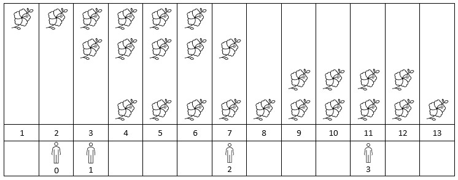
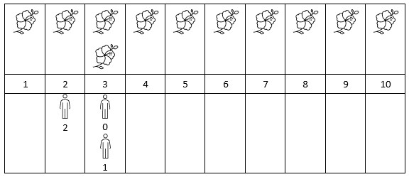

# Number of Flowers in Full Bloom

## Problem Statement

Leetcode: [2251. Number of Flowers in Full Bloom](https://leetcode.com/problems/number-of-flowers-in-full-bloom)


You are given a `0-indexed` 2D integer array flowers, where flowers[i] = [`start_i`, `end_i`] means the `ith` flower will be in full bloom from `start_i` to `end_i` (inclusive). You are also given a `0-indexed` integer array people of size `n`, where `people[i]` is the time that the `ith` person will arrive to see the flowers.

Return an integer array answer of size `n`, where `answer[i]` is the number of flowers that are in full bloom when the `ith` person arrives.

Example 1:


    
    Input: flowers = [[1,6],[3,7],[9,12],[4,13]], poeple = [2,3,7,11]
    Output: [1,2,2,2]
    Explanation: The figure above shows the times when the flowers are in full bloom and when the people arrive.
    For each person, we return the number of flowers in full bloom during their arrival.



    Input: flowers = [[1,10],[3,3]], poeple = [3,3,2]
    Output: [2,2,1]
    Explanation: The figure above shows the times when the flowers are in full bloom and when the people arrive.
    For each person, we return the number of flowers in full bloom during their arrival.

Constraints:

* `1 <= flowers.length <= 5 * 10^4`
* `flowers[i].length == 2`
* `1 <= start_i <= end_i <= 10^9`
* `1 <= people.length <= 5 * 10^4`
* `1 <= people[i] <= 10^9`


## Intuition

Brute-force solution is intuitive. For each person, we can iterate through the flowers and count the number of flowers in full bloom. This is O(P*N) time complexity, where P is the number of people, and N is the number of flowers.

Looking at the constraint, we can see that P and N can be as large as 5 * 10^4. This means that the brute-force solution will time out.

We can optimize the brute-force solution by preparing a sequence of events. 
Each event is a flower blooming or wilting.

For each flower, we can say that it blooms on the `start` day, and wilts on the `end` day. 
For calculating flowers in full bloom on a given day, we can count the flowers for which the `start` day is less than or equal to the given day, and the `end` day is greater than or equal to the given day.

Let's see how we can do that.
Let's say, each day has a number which is by default 0.
We add +1 to each day when flower start blooming, that is each `start_i`.
And we subtract 1 from each day when flower wilts, i.e. `end_i + 1`. 
For example, if a flower is blooming from day 1 to day 3, we add 1 to day 1, and we have to subtract 1 from day 4 as flower is bloomed till day 3 only.

For example: [[1,6],[3,7],[9,12],[4,13]]

| Day | Event |
| --- | ----- |
| 1   | +1    |
| 7   | -1    |
| 3   | +1    |
| 8   | -1    |
| 9   | +1    |
| 13  | -1    |
| 4   | +1    |
| 14  | -1    |

> Note:
> Also, make sure to handle the duplicate days.

We can now sort the events by the day and get the cummulative sum to represent the number of flowers in full bloom on each day.

| Day | Event | Blooming Flowers |
| --- | ----- | ---------------- |
| 1   | +1    | 1                |
| 3   | +1    | 2                |
| 4   | +1    | 3                |
| 7   | -1    | 2                |
| 8   | -1    | 1                |
| 9   | +1    | 2                |
| 13  | -1    | 1                |
| 14  | -1    | 0                |

This can be done in O(N*log(N)) time complexity where N is the number of flowers.
We can sort the events by the day.

For each day, we can keep track of the number of flowers in full bloom. This is O(N) time complexity.

Then, for each person, we can binary search for the flower that is in full bloom when the person arrives.  
Since the days are not continuous, we can't use binary search directly. We can use binary search to find either the same day or an available day just before the day person arrives.

This can be done in O(P*log(N)) time complexity.

## Solution

 
```cpp
class Node {
public:
    int day;
    int flowers;
    Node(int d, int f) {
        day = d;
        flowers = f;
    }
};

bool compareNodes(Node n1, Node n2)
{
    return (n1.day < n2.day);
}

class Solution {
public:
    // get flowers on the desired day or the day available just before that
    int getFlowers(vector<Node>& sequence, int day) {
        if (day < sequence.front().day) {
            return 0;
        }
        if (day > sequence.back().day) {
            return 0;
        }
        int l = 0, r = sequence.size();

        int flowers = 0;

        while (l <= r) {
            int mid = l + (r-l)/2;
            Node n = sequence[mid];

            // printNode(n);

            if (n.day == day) {
                return n.flowers;
            }
            // equal or just smaller, not greater than day
            if (n.day > day) {
                r = mid - 1;
            } else {
                flowers = n.flowers; // record in case we end up missing
                l = mid + 1;
            }
        }

        return flowers;
    }

    vector<int> fullBloomFlowers(vector<vector<int>>& flowers, vector<int>& people) {
        int n = flowers.size();
        vector<Node> sequence;

        map<int, int> added;

        for(int i = 0; i < n; i++) {
            vector<int> flower = flowers[i];
            int start = flower[0];
            if (added[start]) {
                sequence[added[start]-1].flowers++;
            } else {
                sequence.push_back(Node(start, +1));
                added[start] = sequence.size();
            }

            int end = flower[1] + 1;
            if (added[end]) {
                sequence[added[end]-1].flowers--;
            } else {
                sequence.push_back(Node(end, -1));
                added[end] = sequence.size();
            }
        }

        sort(sequence.begin(), sequence.end(), compareNodes);

        int sum = 0;
        for(int i = 0; i < sequence.size(); i++) {
            sum += sequence[i].flowers;
            sequence[i].flowers = sum;
        }

        // print(sequence);

        int c = people.size();

        vector<int> seen(c, 0);
        for(int i = 0; i < c; i++) {
            int flowers = getFlowers(sequence, people[i]);
            // printf("On day: %d, people saw: %d flowers \n", people[i], flowers);
            seen[i] = flowers;
        }

        return seen;
    }

    void printNode(Node s) {
        printf("Day: %d, Flowers: %d\n", s.day, s.flowers);
    }

    void print(vector<Node>& seq) {
        for(auto s: seq) {
            printf("Day: %d, Flowers: %d\n", s.day, s.flowers);
        }

        printf("\n");
    }

};
```

The above code can be written cleanly as follows:

```cpp
class Solution {
public:
    vector<int> fullBloomFlowers(vector<vector<int>>& flowers, vector<int>& people) {
        map<int, int> difference;
        difference[0] = 0;
        
        for (vector<int>& flower : flowers) {
            difference[flower[0]]++;
            difference[flower[1] + 1]--;
        }
        
        vector<int> positions;
        vector<int> prefix;
        int curr = 0;
        for (auto& pair : difference) {
            positions.push_back(pair.first);
            curr += pair.second;
            prefix.push_back(curr);
        }
        
        vector<int> ans;
        for (int person : people) {
            int i = upper_bound(positions.begin(), positions.end(), person) - positions.begin() - 1;
            ans.push_back(prefix[i]);
        }
        
        return ans;
    }
};
```

More solutions [here](https://leetcode.com/problems/number-of-flowers-in-full-bloom/editorial/)

